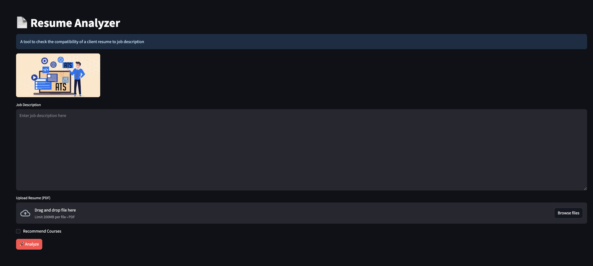
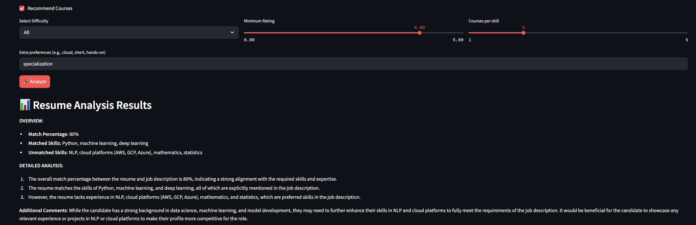
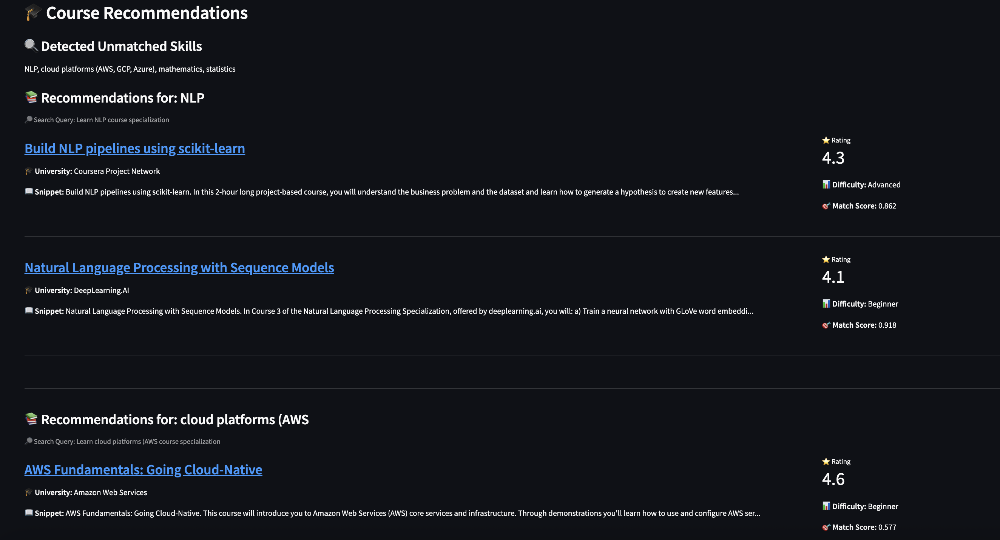

# Resume Analyzer and Course Recommender

[](https://www.python.org/)
[](https://streamlit.io/)
[](https://www.langchain.com/)

This application helps users identify skill gaps between their resume and a job description and suggests relevant Coursera courses to bridge those gaps.





## How it works

The application leverages Large Language Models (LLMs) through the LangChain framework to perform a detailed analysis of a user's resume against a provided job description.

1.  **Input**: The user uploads their resume (in PDF format) and pastes a job description.
2.  **Analysis**: The backend processes the documents to:
    *   Calculate a percentage match score between the resume and the job description.
    *   Identify skills that are present in the job description but are missing from the resume (unmatched skills).
    *   Provide a detailed analysis and additional comments on the user's profile.
3.  **Course Recommendations**: Based on the identified unmatched skills, the application recommends courses from Coursera.
    *   The recommendations are generated by performing a similarity search against a vector database of Coursera courses.
    *   This database was built using the [Coursera Courses Dataset (2021)](https://www.kaggle.com/datasets/khusheekapoor/coursera-courses-dataset-2021) from Kaggle.
    *   Users can filter the recommended courses based on difficulty, minimum rating, and the number of courses per skill.

## How to run the application

1.  **Clone the repository:**
    ```bash
    git clone <repository-url>
    cd ResumeAnalyzer
    ```
2. **Link your OpenAI API key**  
   You will need an OpenAI API key to use this app. Please create one on https://platform.openai.com/

   After you have created one, you will need to create a `.env` file. This `.env` file must be in the project directory root. Then, copy your key into the file using the following template

   ```bash
   OPENAI_API_KEY="<Your API key goes here>"
   ```

    


3.  **Install dependencies:**
    Make sure you have Python 3.8+ installed.
    ```bash
    pip install -r requirements.txt
    ```

4.  **Run the Streamlit application:**
    ```bash
    streamlit run Client/main.py
    ```

5.  Open your browser and go to the local URL provided by Streamlit (usually `http://localhost:8501`).

### Note 
The repository contains an existing vector db instance of the coursera dataset, if this is removed, the initial run will take longer.
